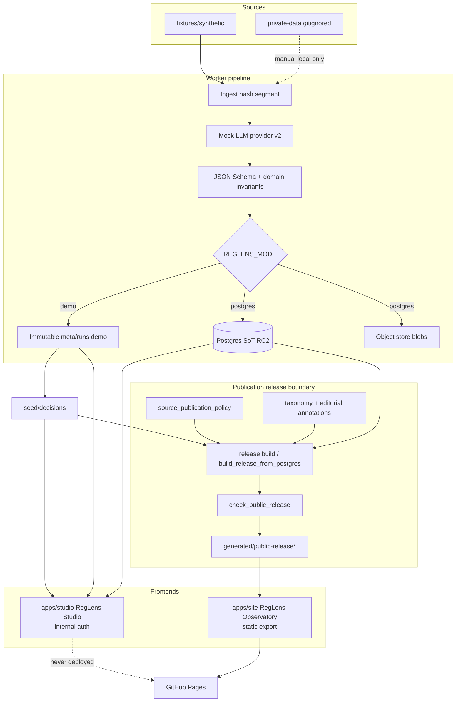

# System architecture (MVP-RC1 / RC2)

RegLens HK is a **two-app** system: an internal Studio for review and local or
Postgres artifacts, and a public Observatory that only consumes a versioned
publication release. Milestone 2A contracts (immutable runs, synthetic/private
boundary) remain the trust foundation. MVP-RC2 adds an explicit
`REGLENS_MODE=demo|postgres` storage split ([ADR 0010](adr/0010-explicit-storage-modes.md)).

## Two-app overview

## Storage modes

| Mode | Operational SoT | `make verify` |
|------|-----------------|---------------|
| `demo` (default) | `data/` filesystem + file job queue | Yes — demo-mode gate |
| `postgres` | `0001_rc2_baseline` + object store | Separate CI / `make integration` |

## Publication release boundary

Everything left of `release build` / `build_release_from_postgres` may contain
raw documents, full page text, confidence scores, pending propositions, and
operator credentials.

Everything right of a successful `check_public_release` must be schema-valid
public artifacts only (excerpt-bounded evidence, no raw PDF/HTML, no model
confidence).

`release_mode`:

| Mode | Allowed fixture_kind | Policy behaviour |
|------|----------------------|------------------|
| `synthetic_demo` | `synthetic` only | Forces `public_excerpt` for demo; real sources excluded |
| `public` | `real` only | Honours per-source visibility; **refuses** `internal_only` |

Current policy files mark MCHK and DCHK as `internal_only`, so a real public
release is **blocked** until policy and consent posture change.

## App responsibilities

| Concern | Studio (`apps/studio`) | Observatory (`apps/site`) |
|---------|------------------------|---------------------------|
| Auth | Roles: reviewer / publisher / admin (RC2) | None |
| Data | demo `data/` or Postgres | `public/data/release/*` only |
| Search | Studio FTS (Postgres) / local substring (demo) | Client-side filter over catalog JSON |
| Deploy | Local / private hosts only | Static export → Pages |
| Review / publish | Review + publication transaction | Read-only |

## Milestone notes

- **2A / RC1:** contracts, Observatory, Pages.
- **RC2:** Postgres SoT, modes, jobs/leases, revisions, publication transaction,
  operator tooling/docs (Checkpoint D partial). See [`MILESTONES.md`](MILESTONES.md).

Compose uses `postgres:16` (no pgvector). Credentials are local-only; always
`make db-migrate` after `db-up`.
