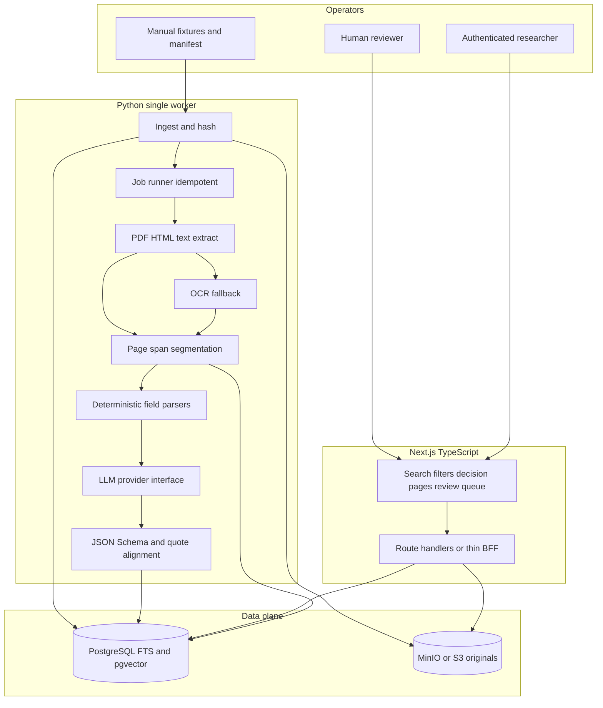

# System architecture

## Diagram



## Design notes

- One worker process polls `jobs` (`FOR UPDATE SKIP LOCKED`) when the job table is wired; Milestone 1 uses a synchronous fixture ingest CLI writing a local artifact store that mirrors blob + metadata behaviour.
- LLM behind `LLMProvider.extract(doc_ctx) -> dict`; mock provider for tests and Milestone 1.
- Documents are untrusted data: prompts wrap content in delimiters; no tool-calling from document text.
- Compose services: `db` (pgvector/pg16), `minio`. Web and worker commonly run on the host in early milestones.

## Repository tree

```text
reglens-hk/
  AGENTS.md
  README.md
  LICENSE                    # product code licence; not a data licence
  docker-compose.yml
  .env.example
  docs/
    ASSUMPTIONS.md
    PRD.md
    SOURCE_LICENSING_AUDIT.md
    SCHEMA.md
    EXTRACTION_SCHEMA.md
    ARCHITECTURE.md
    RISKS.md
    EVALUATION.md
    MILESTONES.md
    EXCLUSIONS.md
    LOCAL_SETUP.md
    approvals/
    licensing/
  fixtures/
    raw/mchk/
    raw/dchk/
    manifests/
    gold/
    seed/                    # checked-in demo seeds from synthetic fixtures
  apps/
    web/                     # Next.js UI + API routes
  services/
    worker/                  # Python ingest / OCR / extract
  packages/
    db/migrations/
    extraction-schema/
  scripts/
    download_checklist.md
    hash_manifest.py
  tests/
    parsers/
    schemas/
    provenance/
```
