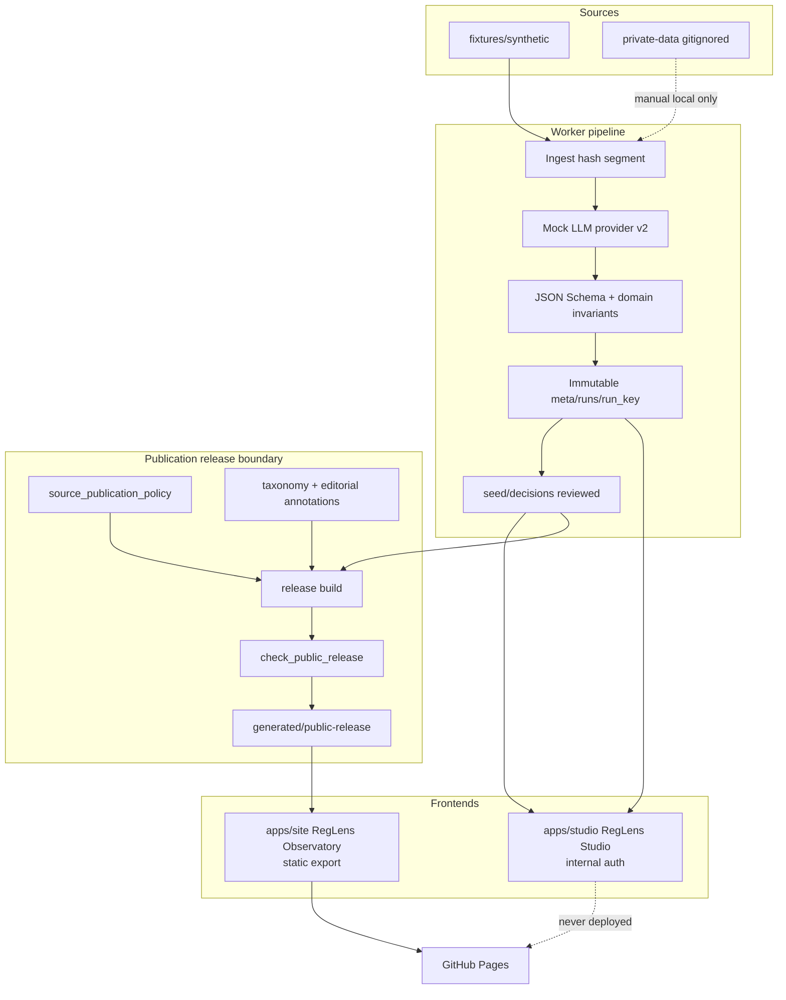

# System architecture (MVP-RC1)

RegLens HK is a **two-app** system: an internal Studio for review and local
artifacts, and a public Observatory that only consumes a versioned publication
release. Milestone 2A contracts (immutable runs, synthetic/private boundary)
remain the trust foundation.

## Two-app overview



ASCII equivalent:

```text
fixtures/synthetic ──┐
                     ├──► ingest → extract v2 → immutable runs → seed/decisions
private-data/ ───────┘                              │
                                                    ├──► Studio (local, auth)
                                                    │
                         policy + taxonomy + annotations
                                                    │
                                                    ▼
                                         release build + public-scan
                                                    │
                                                    ▼
                                      generated/public-release
                                                    │
                                                    ▼
                                         apps/site → GitHub Pages
```

## Publication release boundary

Everything left of `release build` may contain raw documents, full page text,
confidence scores, pending propositions, and operator credentials.

Everything right of a successful `check_public_release` must be:

- schema-valid public decisions / catalog / analytics / CSV;
- excerpt-bounded evidence only (or metadata-only if policy requires);
- free of raw PDF/HTML and full page-text arrays;
- free of model `confidence` and extractor run metadata;
- privacy-scanned for residual patient-style tokens.

`release_mode`:

| Mode | Allowed fixture_kind | Policy behaviour |
|------|----------------------|------------------|
| `synthetic_demo` | `synthetic` only | Forces `public_excerpt` for demo; real sources excluded |
| `public` | `real` only | Honours per-source visibility; **refuses** `internal_only` |

Current policy files mark MCHK and DCHK as `internal_only`, so a real public
release is **blocked** until policy and consent posture change.

## App responsibilities

| Concern | Studio (`apps/studio`) | Observatory (`apps/site`) |
|---------|------------------------|---------------------------|
| Auth | Cookie session; fail-closed in production | None |
| Data | Local `data/` seed + run artifacts | `public/data/release/*` only |
| Search | Experimental keyword/substring (2D) | Client-side filter over catalog JSON |
| Deploy | Local / private hosts only | Static export → Pages |
| Review / publish | Review UI (experimental 2C) | Read-only |

## Milestone notes

- **2A (complete):** contracts, determinism, privacy boundary, CI.
- **2B–2D (experimental):** Postgres, jobs, Studio auth/review, local search —
  present in-tree but **not** RC1 production claims. See [`MVP_BACKBONE.md`](MVP_BACKBONE.md).
- **MVP-RC1:** Observatory + publication release + Pages workflow.

Compose (`docker-compose.yml`) remains for optional local Postgres/MinIO prep;
image tags are pinned; credentials labelled local-only.
