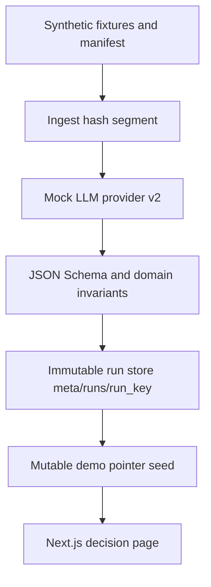

# System architecture (Milestone 2A)

## Milestone 2A focus

Trusted contracts, deterministic immutable artifacts, synthetic/private-data boundary, and CI.
PostgreSQL persistence, MinIO wiring, authentication, review UI, and search are **out of scope** for 2A (see Milestone 2B+).

## Design notes

- Documents are untrusted data.
- Mock provider only; no network LLM calls.
- Atomic writes; run-key conflicts quarantine differing outputs.
- Compose file remains for local infra prep; image tags are pinned; credentials labelled local-only.
